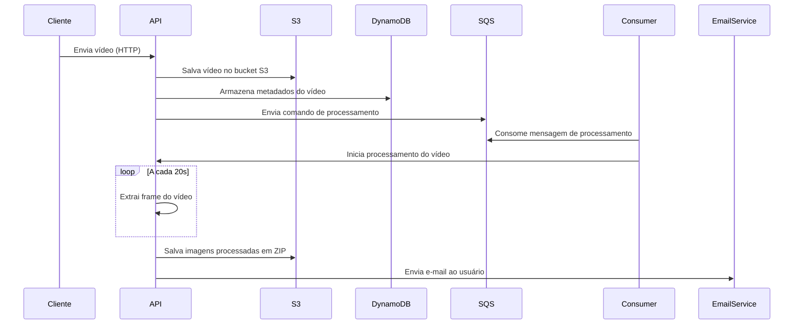

# Hackathon - Video Extractor

## Integrantes:

- Victor Hugo da Costa Leite
- Pedro Giménez Miranda silva
- Flavio Henrique Soares Cabral


<p align="center">
 <a href="#sobre">Sobre</a> •
 <a href="#como-executar-api-localmente">Como Executar API localmente</a> •
 <a href="#como-visualizar-o-swagger">Como Visualizar o Swagger</a> •
</p>

## Sobre

Video Extractor API: Sistema de extração de imagens de vídeo.

Este sistema tem como objetivo processar um arquivo .mp4 tirando prints do vídeo a cada 20s e gerar um arquivo zip
contendo as imagens geradas.

## Como Executar API localmente

### Iniciar localstack com serviços da AWS usando docker-compose

```
docker-compose up -d
```

A criação dos servições já está automatizada, mas caso não funcione seguem os comandos para sua criação manual após o
container estar funcionando.

#### criar bucket s3

```
aws --endpoint-url=http://localhost:4566 s3 mb s3://images-extractions
```

#### Criar tabela no dynamodb

```
aws --endpoint-url=http://127.0.0.1:4566 dynamodb create-table \
    --table-name extraction_info \
    --attribute-definitions AttributeName=user_id,AttributeType=S AttributeName=id,AttributeType=S \
    --key-schema AttributeName=user_id,KeyType=HASH AttributeName=id,KeyType=RANGE \
    --provisioned-throughput ReadCapacityUnits=1,WriteCapacityUnits=1
```

#### Criar fila de comandos

```
aws --endpoint-url=http://127.0.0.1:4566 sqs create-queue --queue-name extraction-info-queue

```

## Como Visualizar o Swagger

Este projeto conta com Swagger para especificação e documentação da API. Para visualizar, basta executar localmente o
projeto, como indicado na seção [Como Executar API localmente](#como-executar-api-localmente). E então acessar o link
abaixo:

[Link Swagger](http://localhost:8080/swagger-ui/index.html)

## Driagrama de sequência



## Documento de arquitetura

[Link do documento de arquitetura](https://docs.google.com/document/d/1nfmgcLGsvvb6R4hX-ZR9Nt6rrGdCiUL1hz-plsojUwE/edit?tab=t.0)

## Outros repositórios

[COLOCAR REPOSITÓRIOS DA INFRA]
